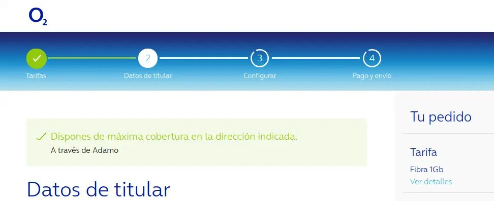

# acuerdos-fibra-o2

[](https://github.com/fercarcedo/acuerdos-fibra-o2/blob/main/README.md)

[](https://chromewebstore.google.com/detail/acuerdos-fibra-o2/aacfgcicjaofeigkndomcdefggpigjkg)
[](https://addons.mozilla.org/es/firefox/addon/acuerdos-fibra-o2/)

## Descripción

Acuerdos fibra O2 es una extensión del navegador (disponible para Chrome y Firefox, incluido Firefox para Android) que permite visualizar qué red de fibra utiliza O2 en tu dirección (distinguiendo entre fibra propia, a través de Adamo o a través de Orange).

Una vez instalada, simplemente comprueba cobertura en la web de O2 y si la comprobación es positiva aparecerá debajo el tipo de fibra:



## Compilación

El código fuente de la extensión es compartido para Chrome y Firefox. Sin embargo, existen dos manifest.json diferentes, uno para cada navegador. Adicionalmente, el manifest.json de Firefox utiliza la versión 2 en lugar de la 3 de Chrome, ya que de esta forma es compatible con Firefox para Android, que en estos momentos no soporta aún Manifest V3 (sin embargo, el código usa las nuevas APIs para ambos navegadores ya que Firefox desde la versión 102 soporta en Manifest V2 las nuevas APIs).

Por este motivo, se ha introducido un pequeño paso de compilación que lo que hace es aplicar el manifest correspondiente a cada navegador junto con el ćodigo común y los iconos y generar los ficheros finales en una carpeta dist (dentro de una carpeta chrome y otra firefox):

```
npm run build-firefox
```

```
npm run build-chrome
```

Estos comandos copian tanto la extensión descomprimida (por ejemplo, para cargarla localmente en Chrome para hacer pruebas) y también generan un zip para subir a las stores