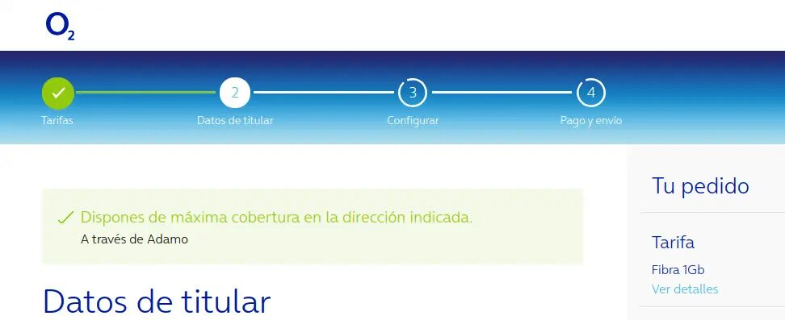

# acuerdos-fibra-o2

[](https://github.com/fercarcedo/acuerdos-fibra-o2/blob/main/README.md)
[](https://github.com/fercarcedo/acuerdos-fibra-o2/blob/main/README.es.md)

[](https://chromewebstore.google.com/detail/acuerdos-fibra-o2/aacfgcicjaofeigkndomcdefggpigjkg)
[](https://addons.mozilla.org/es/firefox/addon/acuerdos-fibra-o2/)

## Description

Acuerdos fibra O2 is a browser extension (available for both Chrome and Firefox, including Firefox for Android) that allows the user to view which fiber network O2 uses (the flanker brand of the spanish operator Movistar) in the specified address (distinguishing between own fiber, via Adamo or via Orange).

Once installed, simplify check coverage in the O2 website and if successful, the type of fiber will appear below:



## Building

The extension source code is shared between Chrome and Firefox. However, there are two different manifest.json files, one for each browser. Additionally, the Firefox manifest.json uses version 2 instead of version 3, which is used for Chrome, in order to be compatible with Firefox for Android, which at the time of writing doesn't support Manifest V3 (the code, however, uses the same APIs for both browsers because since version 102 Firefox supports the new APIs on Manifest V2).

For this reason, this project features a small build step that applies the right manifest for each browser along with the shared code and the icons and generates the resulting files in a dist folder (in a chrome and firefox subfolders):

```
npm run build-firefox
```

```
npm run build-chrome
```

These commands copy both the uncompressed extension (for example, in order to load it locally in Chrome for testing) and a zip file to upload to the stores.